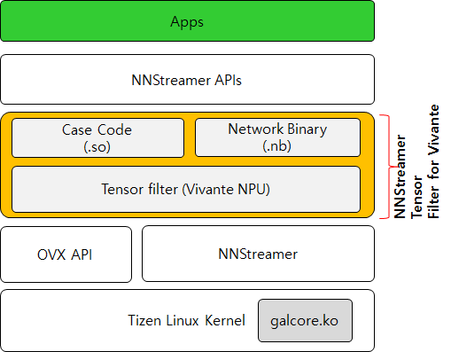

## Introduction
This repository is to generate shared libraries from a case code in order to run various Vivante models that are called the network binary (.nb).



**[The operation structure of the Vivante tensor filter]**

In this section, we depict how to generate .so library for new Vivante model.
First of all, you must put the case code (source files) of new Vivante model into the ./models/ folder.
Note that Vivante company provides the `build_vx.sh` file to generate the ELF file from the source code (case code) by default for Ubuntu 18.04 aarch64 distribution.
If you do not have an experience on a library packaging (.so) that is required in order to interconnect the network model of Vivante NPU to NNStreamer, you need to refer to the `mybuild-tizen.sh` in the existing `./models/inceptionv3` directory.

## Tools
The tool files are located in the `./models/tools/` directory. 
* `./models/tools/build-strap/`: This folder is to generate a .so file as a build-strap facility. The build-strap has simplified the process of creating custom .so file by clearing out all of the unnecessary procedures.
* `./models/tools/gbs-build-conf/`: This folder consists of gbs configuration file to use `gbs build` command for Tizen.
* `./models/tools/setup_dev/`: This folder is to provide the platform developer with various methods for improving a development productivity.
* `./models/tools/unittest_dlopen/`: This folder is to test if dlopen() mechanism can be executed normally on the real target board.
* `./models/tools/setup_dev/zypp/repos.d/`:  This folder is to support the configuration files to use `zypper` command on the real target board. The developer can easily install and update the RPM files such as `apt-get` command.

## Models
For more details, please press [HERE](./models/README.md).
 
### Case study: Inceptionv3
This section is to address (1) how to verify the case code that are generated the Vivante tool and (2) how to execute a self-assessment for a continuous integration (CI).
First of all, the contributors have to evaluate the case code and the Vivante tensor filter on the real target board before submitting PRs as follows.
If you are using Tizen platform, you may use the `/opt/usr/` folder instead of `${USB_MOUNT}`. The `${USB_Mount}` means a mount folder that the USB storage is mounted on the real target board. However, from our experience, we recommend that you utilize available USB storage to avoid a storage shortage while developer new features.

#### Step 1: Re-organize source files of a new Vivante model for NNStreamer Vivante filter
1. Create new folder such as `./model/{new_model_dir}`.
2. Put the `main.h` file into the `{new_model_dir}` folder from an existing model directory.
3. Please refer to the `static` of functions are removed in the `main.h` file. Then, remove the "static" data type of the functions after opening the existing `main.c` file. It aims that the Vivante tensor filter calls symbols in a `.so` file with dlopen() library call.
4. Put the `mybuild-tizen.sh` file into the `{new_model_dir}` folder from an existing model directory.
5. That's all. Please execute the `mybuild-tizen.sh`file  on the real target board.

To execute the above statements once, you may execute the `./init_model_so.sh` file as follows. 
```bash
target# cd ./model
target# ./init_model_so.sh {new_model_dir}
```


#### Step 2: Removing the existing RPM files to do a clean test for the platform integrity
Before starting this work, you need to remove the existing packages cleanly as follows.
```bash
target# rpm -qa | grep vivante
target# rpm -e nnstreamer-vivante
target# rpm -e vivante-neural-network-models
target# ls -al /usr/share/vivante/
target# ls -al /usr/lib/nnstreamer/filters/
```

#### Step 3: Generating .so file from the case code
In order to use NNStreamer Vivante filter, you must generate .so file from the case code as follows. Then the .so file has to be run with dlopen() mechanism because the Vivante tensor filter is based on the dynamic loading technique.
```bash
target# cd /${USB_Mount}/
target# git mount https://github.sec.samsung.net/AIP/vivante-neural-network-models.git
target# cd vivante-neural-network-models
target# cd ${USB_Mount}/vivante-neural-network-models.git/models/inceptionv3/
target# ./mybuild-tizen.sh
```

#### Step 4: Evaluating a generated so file (e.g., libinceptionv3.so).
For more details, refer to https://github.sec.samsung.net/AIP/nnstreamer-private-plugins
If you are developing NNstreamer application on the Tizen-based real target board, we recommend that you use a USB Stick to avoid a storage shortage.
```bash
target# cd ${USB_Mount}/nnstreamer-private-plugins.git/
target# ./tests/nnstreamer_filter_vivante/build_run.sh
```

## Reference
* https://www.github.com/nnstreamer/

